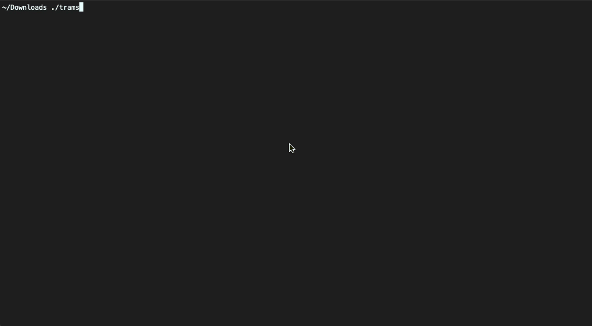

# trams
A command line application written in Go to display realtime departure information for Metrolink
trams in the [Transport for Greater Manchester (TfGM)](https://tfgm.com/public-transport/tram) area in the UK. 

The information displayed is the same as displayed on the physical departure boards at each Metrolink station.

The backend API providing the data is a GCP Cloud Function also written in Go. 
[The repository is here](https://github.com/ayubmalik/tramsfunc).

## Display departure information
To display information for a specific station run the `trams display` command with a list of all short
station codes you want to display e.g. ABM CHO EXS etc.

**If you do not provide any short station codes then _all_ Metrolink stations will be displayed.**


## List station codes and names 
To get a list of all the station codes (e.g. ABM, CHO etc) run the `trams list` command.



## Help and version information

```
./trams help
```

```
./trams version
```

## Installation
As well as building from this source repository, you can download a binary fro Linux, Mac and Windows from 
the [Releases page](https://github.com/ayubmalik/trams/releases#assets) under the assets section.

Once downloaded you will probably have to make the binary executable. 
One Linux you can run the following command assuming it is in the `Downloads` folder.

```
chmod +x ~/Dowloads/trams
```

and to run

```
~/Downloads/trams display
```

## Lipgloss
All the colours and layout were generated using the awesome [Lipgloss](https://github.com/charmbracelet/lipgloss) library!